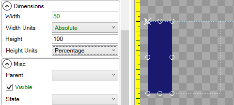
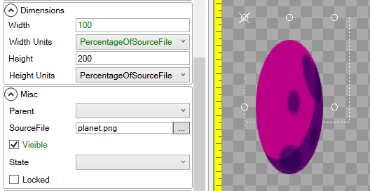

# Introduction

The **Height Units** variable controls how a unit is vertically sized, which may be relative to its parent. By default an object uses **Absolute** height, where each unit represents 1 pixel of height in pixels. When using **Absolute**, an object ignores its parents' With.

# Absolute

The following shows a child [ColoredRectangle](ColoredRectangle) with 50 **Absolute** Height:

# Percentage

The following shows a child [ColoredRectangle](ColoredRectangle) with 100 **Percentage** Height, which means it will have 100% of the height of its parent. Note that 100 **Percentage** is the same as 0 **RelativeToContainer**:

# RelativeToContainer

The following shows a child [ColoredRectangle](ColoredRectangle) with -10 **RelativeToContainer** Height, which means it will always be 10 pixels less tall than its parent.

# RelativeToChildren

The following image shows a child [ColoredRectangle](ColoredRectangle) with 50 **RelativeToChildren** Height, which means that it will always be 50 pixels taller than is necessary to contain its children. Since the rectangle has no children, this is the same as having 50 **Absolute** Height:

**RelativeToChildren** can be used to size an object based on the position and sizes of a container's children. The following image shows a container with 0 **RelativeToChildren** Height, which mans that its height is set just large enough to contain its children.

A non-zero **Height** when using **RelativeToChildren** can be used to add additional padding to a parent container. The following image shows a container with 20 pixels of padding height:

For more information on relative layout in regards to absolute vs. relative unit types, see the [Relative Layout Unit Type](Relative-Layout-Unit-Type) page.

# PercentageOfSourceFile

The [Sprite](Sprite) type has an extra **Height Unit** called **PercentageOfSourceFile**, which will set the height of the Sprite according to the file that it is displaying. This is the default **Height Unit** for Sprites.

The following image shows a child [Sprite](Sprite) with 200 **PercentageOfSourceFile** Height, which means it will draw two times as tall as its source image:

