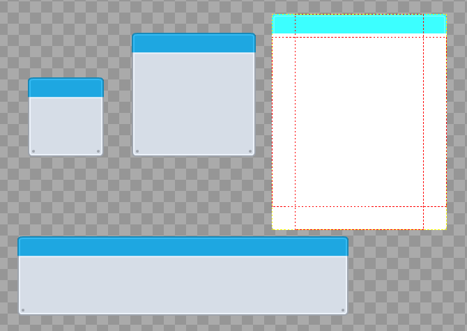
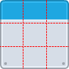

# Introduction

NineSlice is a standard component which can be used to create visual objects which can stretch to any size without creating distortion on the source image. For example, consider the following image:

This image could be used to create nine slices of various sizes without any distortion:

The NineSlice achieves this effect by splitting the texture into nine pieces, and scales each one differently to prevent distortion. Highlighting a nine slice shows how it is split:

This is achieved by splitting the texture into 1/3 sections wide and tall. The following image shows how the original image will be split:

# NineSlice Texture

The simplest way to assign a texture to a NineSlice is to use a single file. Setting the _SourceFile_ to a single PNG will result in the NineSlice using that one texture, where each section of the NineSlice displays 1/3 of the width of the file and 1/3 of the height of the file.

Alternatively, nine files can be used to specify each section of the NineSlice independently. To use nine individual files, each file must be given a specific suffix. 

The following suffixes can be added to create nine slice graphics.  For example, assuming your NineSlice image is called "Image" and you are using the .png file format:

* Image_BottomCenter.png
* Image_BottomLeft.png
* Image_BottomRight.png
* Image_Center.png
* Image_Left.png
* Image_Right.png
* Image_TopCenter.png
* Image_TopLeft.png
* Image_TopRight.png

NineSlice Properties

* [NineSlice.Texture Address](NineSlice.Texture-Address)