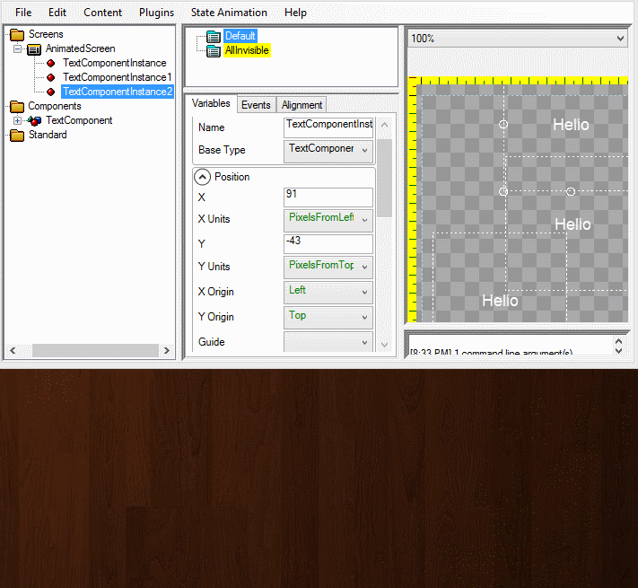
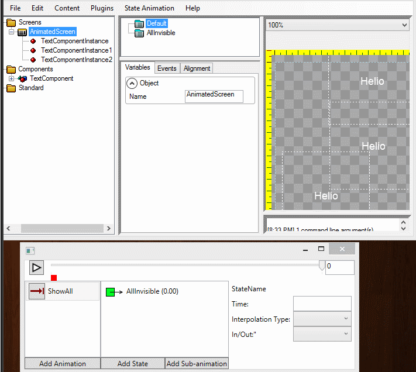

# Introduction

Gum supports creating animations which can play other animations.  This is especially useful when creating animations in Screens that contain components which themselves have animations.  This tutorial will build upon the [previous tutorial](Usage-Guide_-Creating-an-Animation) where we created an animated component called TextComponent.

# Creating a Screen

First we'll create a Screen called AnimatedScreen.  To do this:

1. Right-click on Screens
1. Select "Add Screen"
1. Enter the name "AnimatedScreen" and click the OK button
1. Drag+drop a few TextComponents into the Screen and spread them out visually

# Defining the initial state

The animation we will be creating in our Screen will start with all TextComponents being invisible, then each one appearing by playing their Show animation.  The animations will be slightly staggered.  First we'll add the initial state where all of the TextComponents are invisible.  To do this:

1. Verify that the AnimatedScreen is selected
1. Right-click in the states area and select "Add State"
1. Name the state "AllInvisible" and click OK
1. Select one of the TextComponents 
1. Set its State to Hidden
1. Repeat setting the State to Hidden for the other TextComponents

# Creating the Animation

Now we have all of the states and animations that we'll use as keyframes in our animation.  To create the animation:

1. Select AnimatedScreen
1. Select "State Animation" -> "View Animations"
1. Click "Add Animation"
1. Name the animation "ShowAll"
1. Select the ShowAll animation
1. Click "Add State"
1. Select "AllInvisible" and click OK

The animation now sets all TextComponents to their Hidden state initially.

# Adding Sub-Animations

Next we'll be adding animations to animate the TextComponent instances to visible.  To do this:

1. Bring up the animation window for AnimatedScren if it is not already showing
1. Select "ShowAll"
1. Click "Add Sub-animation"
1. Select the first TextComponentInstance
1. Select the Show animation and click OK
1. Select the newly-created animation and set its Time to 0.5
1. Repeat the above steps to add animations for the other two TextComponents, but set their times to 1.0 and 1.5

Now the animation can be played or previewed with the slider bar:

