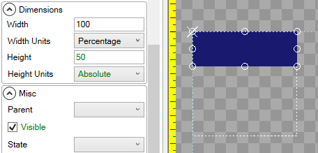

# Introduction

The **Width Units** variable controls how a unit is horizontally sized, which may be relative to its parent. By default an object uses **Absolute** width, where each unit represents 1 pixel of width in absolute terms. When using **Absolute**, an object ignores its parents' With.

# Absolute

The following shows a child [ColoredRectangle](ColoredRectangle) with 50 **Absolute** Width:

# Percentage

The following shows a child [ColoredRectangle](ColoredRectangle) with 100 **Percentage** Width, which means it will have 100% of the width of its parent. Note that 100 **Percentage** is the same as 0 **RelativeToContainer**:

# RelativeToContainer

The following image shows a child [ColoredRectangle](ColoredRectangle) with -10 **RelativeToContainer** Width, which means it will always be 10 pixels less wide than its parent.

# RelativeToChildren

The following image shows a child [ColoredRectangle](ColoredRectangle) with 50 **RelativeToChildren** Width, which means that it will always be 50 pixels wider than is necessary to contain its children. Since the rectangle has no children, this is the same as having 50 **Absolute** Width:

**RelativeToChildren** can be used to size an object based on the position and sizes of a container's children. The following image shows a container with 0 **RelativeToChildren** Width, which mans that its width is set just large enough to contain its children. Since the rectangle on the right is the furthest-right rectangle, the width of the container is set to be wide enough to contain the right-edge of the furthest-right blue rectangle.

A non-zero **Width** when using **RelativeToChildren** can be used to add additional padding to a parent container. The following image shows a container with 20 pixels of padding width:

**RelativeToChildren** will dynamically adjust to changes in properties on the children. In the following animation the container has a **Children Layout** of **LeftToRightStack**. Adding additional children expands the container automatically:

For more information on relative layout in regards to absolute vs. relative unit types, see the [Relative Layout Unit Type](Relative-Layout-Unit-Type) page.

# PercentageOfSourceFile

The [Sprite](Sprite) type has an extra **With Unit** called **PercentageOfSourceFile**, which will set the width of the Sprite according to the file that it is displaying. This is the default **Width Unit** for Sprites.

The following image shows a child [Sprite](Sprite) with 200 **PercentageOfSourceFile** Width, which means it will draw two times as wide as its source image:

