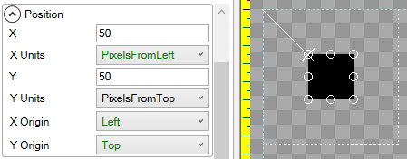

# Introduction

The **Y Units** variable controls how a unit is vertically positioned relative to its parent. By default an object is positioned relative to the top of its parent, where each unit represents 1 pixel downward.

## PixelsFromTop

The followingshows a child [ColoredRectangle](ColoredRectangle) positioned 50 **PixelsFromTop** relative to its parent:

## PixelsFromCenterY

The followingshows a child [ColoredRectangle](ColoredRectangle) positioned 50 **PixelsFromCenterY** relative to its parent:

## PixelsFromCenterYInverted

The followingshows a child [ColoredRectangle](ColoredRectangle) positioned 50 **PixelsFromCenterYInverted** relative to its parent. Note that coordinates are "inverted", which means that increasing the Y value moves the object up rather than down. This value exists to simplify integration with engines which may use positive Y as up:

## PixelsFromBottom

The followingshows a child [ColoredRectangle](ColoredRectangle) positioned 50 **PixelsFromBottom** relative to its parent:

## PercentageHeight

The followingshows a child [ColoredRectangle](ColoredRectangle) positioned 50 **PercentageHeight** relative to its parent:

