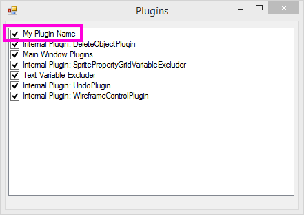

# Introduction

This page discusses how to write plugins for Gum.  Plugins are a useful way to modify Gum because they allow you to customize Gum without making project-specific, technology-specific, or organization-specific modifications to the core source code.  This means that you can customize the Gum experience while still maintaining ties to the core source code.  

# Setup

To begin writing a plugin:

1. Obtain the Gum source code.  You can download the .zip or get the source through a version control client
1. Create a copy of Gum.sln.  You will want to work with your own .sln file so that the project containing your plugin can be debugged easily.  For example, you might want to call your solution GumWithPlugins.sln
1. Open your new .sln file in Visual Studio

Now that you have created a .sln which will contain your plugin project, you can add this project:

1. Right-click on your solution
1. Select "Add ->New Project..."
1. Select "Class Library" as the type
1. Verify that you are targeting .NET 4.5
1. Enter the name of your project, such as MyPluginProject
1. Click OK

Next you'll need to reference the Gum libraries.  To do this:

1. Right-click on your project's References
1. Select "Add Reference"
1. Verify that "Solution" is selected (Assuming Visual Studio 2012)
1. Check the following projects:
	1. Gum
	1. GumDataTypes
	1. InputLibrary
	1. RenderingLibrary
	1. ToolsUtilities
1. Click OK

Since Gum references XNA, and XNA doesn't have 64 bit libraries, you will need to modify your project's build configuration.  To do this:

1. Select the "Build"->"Configuration Manager" menu item
1. Change the Active solution platform" from "Mixed Platforms" to "x86" if it isn't already set to x86.  If your Active solution is set to "Any CPU", change that to "x86"
1. If your plugin project's Platform is set to "Any CPU", use the drop down to pick "x86" if it exists.  If not, select "<New...>"
	1. Change the New platform to "x86"
	1. Click "OK"
1. Make sure your plugin project is set to build
1. Click Close to close the Configuration Manager
1. Adding a Plugin class

Next you'll want to add a Plugin class.  This is a class that inherits from PluginBase.  To do this:

1. Right-click on your project
1. Select "Add->Class..."
1. Name your class "MyPlugin" or whatever you want your plugin to be called
1. Add the following using:  {{ using Gum.Plugins.BaseClasses; }}
1. Modify your plugin so it's public and inherits from PluginBase: {{ public class MyPlugin : PluginBase }}
1. Add the following implementation into your plugin class:
```
        public override string FriendlyName
        {
            get { return "My Plugin Name"; }
        }

        public override Version Version
        {
            get { return new Version(0, 0, 0, 0); }
        }

        public override void StartUp()
        {
            // Add startup logic here:
        }

        public override bool ShutDown(Gum.Plugins.PluginShutDownReason shutDownReason)
        {
            return true;
        }

```

# Getting your plugin into Gum

Now that you have a simple plugin, you need to do two things to test this plugin out.  The first is to mark the plugin as a class that is exported using Microsoft Extension Framework.  To do this:

1. Right-click on your project's References item in the Solution Explorer
1. Select "Add Reference..."
1. Click the "Assemblies->Framework" tab
1. Check "System.ComponentModel.Composition"
1. Click OK
1. Add the following using statement to your plugin class:  ` using System.ComponentModel.Composition; `
1. Modify your class definition so it looks like this (we're making it public and also adding the Export attribute:
```
  [Export(typeof(PluginBase))](Export(typeof(PluginBase)))
  public class MyPlugin : PluginBase
```

Now you can right-click on your project and select Build and it will generate a .dll for your project.  This .dll file needs to be in the Plugins folder under the Gum binary.  That is, from the location of your .sln file, you can go to {{\Gum\bin\Debug\Plugins}}.  Once there, you will need to create a folder for your plugin (like MyPlugin) and place your .dll there.

To verify that your plugin is working correctly:

1. Run Gum
1. Click Plugins->"Manage Plugins"



# Troubleshooting

## The type or namespace name 'PluginBase' could not be found

This may happen if you are targeting different versions of the .NET framework.  At the time of this writing Gum targets .NET 4.5.  Therefore, you'll want to make sure that your Plugin project also targets .NET 4.5.  To do this:

1. Right-click on your project
1. Select "Properties"
1. Select the "Application" tab
1. Verify that the "Target Framework:" is set to .NET Framework 4.5 (or whatever version Gum is currently on)

# Subsections

* [Setting Up Post Build Events](Setting Up Post Build Events)
* [PluginBase.AddAndRemoveVariablesForType](PluginBase.AddAndRemoveVariablesForType)
* [PluginBase.AddMenuItem](PluginBase.AddMenuItem)
* [PluginBase.Export](PluginBase.Export)