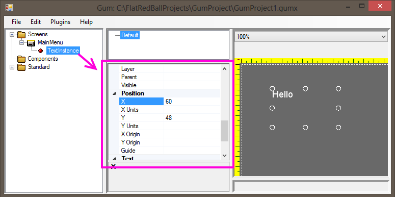
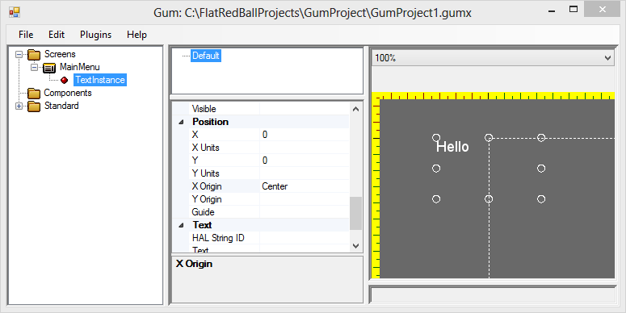
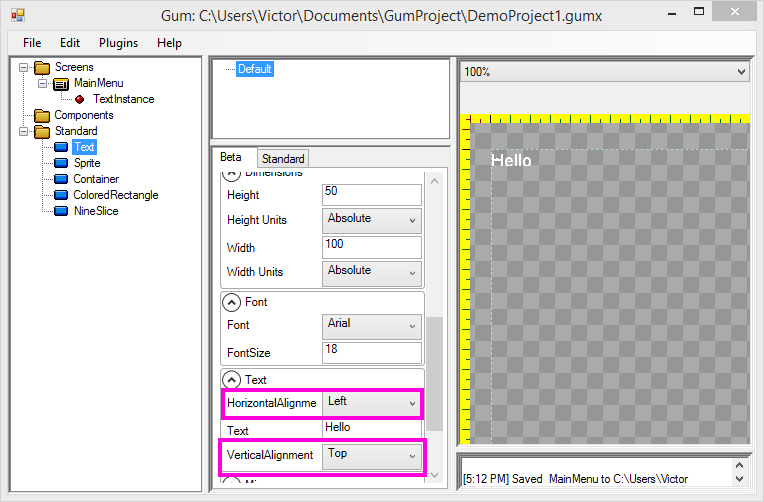
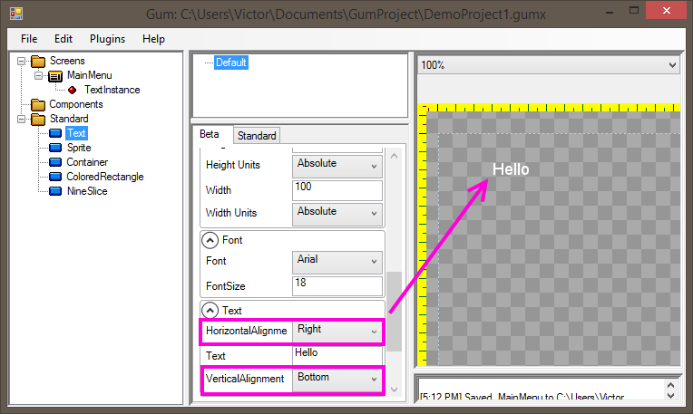
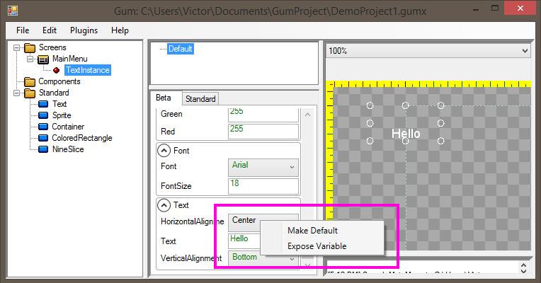

# Introduction 

The properties window in Gum is used to provide extensive control over instances.  While the visual editor is very handy for quick edits such as positioning and resizing instances, the properties window exposes all properties.  It is also useful for making fine changes to instances, such as by moving an instance by a single pixel.

The properties window will show properties for the selected instance or element. 

# Editing Properties

Properties can be edited simply by changing values on the selected property.  For example, to change the text so that it is positioned against the top-left of the screen, change its X and Y properties to 0:

# Positioning Instances

Instances have an advanced positioning system.  The position of an element is a result of a number of variables.  We'll go over a few here.

By default all objects are positioned by their top-left corner.  In the example above we set the Text object's X and Y to 0, which aligned its top-left position to the top-left of the screen (which is identified by a dotted line.

We can change the origin of the Text object by setting its "X Origin" and "Y Origin" values.  Notice that if X Origin is set to "Center" then the Text object is positioned by its center:

Notice that I had to pan the view to be able to see the Text object.  To pan the view, press and hold the middle mouse button while the cursor is over the preview window.  While the middle mouse button is down, move the mouse cursor.

Changing the X Origin value changes the origin of the selected instance; however, it is still positioned relative to the top-left corner of the Text instance's container - which in this case is the entire screen designated by the dotted white outline rectangle.

We can change the origin that the Text is relative to by changing the X Units.  By default the X Units property is set to "PixelsFromLeft" for X and "PixelsFromTop" for Y.  Changing the X Units to "PixelsFromRight" will cause the Text to be positioned on the right-side of the screen.  Notice that changing the units value will automatically update the X or Y values as appropriate.  This is why my X value is now showing a value of -800:

# Text Alignment
The X,Y values, Origin values, and Units values are all available for every type of element in Gum; however, these values only change the bounds.  In the case of a Text object we may be interested in how the text is aligned within the bounds.  The Text object offers two properties for aligning its text:  VerticalAlignment and HorizontalAlignment.  Changing the HorizontalAlignment to Center will center the Text within its bounds:

# Default and overriding values
You may have noticed that some properties in the property grid are green while others are black.  For example, in the image above the TextInstance's VerticalAlignment is "Top", but it is green.  The reason for this is because instances are not required to define values for every property.  Whenever an instance does not define a property, it uses the property that is defined in the Standard Element definition.

To see how this works, select the "Text" item under the "Standard" item.  Notice that all values are black.  Notice the default values for HorizontalAlignment and VerticalAlignment:

If the default HorizontalAlignment and VerticalAlignment values are changed, the changes will immediately be reflected in the preview window for the default Text configuration:

Now if we select the TextIntance we will see that the VerticalAlignment is visibly using the Bottom value; however the HorizontalAlignment is still using center - this is because a value that is explicitly set on an instance will always override the default value set in the Standard element. Notice that HorizontalAlignment is black (indicating a custom value) and VerticalAlignment is green (indicating a default value).

Values can be reverted back to their default simply by right-clicking on the variable name in the properties window and selecting "Reset to default"

