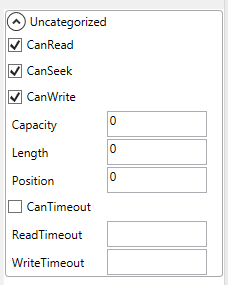

# DataUiGrid

## Introduction

The DataUiGrid is similar to Winforms PropertyGrid - a reflection-based UI object which can be used to display the properties on objects in real-time. It is used for the properties on Gum objects, but is written to be general purpose to be used in any applications.

It is included in the WpfDataUi.dll file which is part of Gum, so this library can be pulled out and used in any other application.

The DataUiGrid can be used with reflection or its Categories can be manually populated. Using reflection is easier to set up, but does not provide as much flexibility. Manually building up Categories takes more work, but provide the most flexibility.

## Adding References

The following references are needed for displaying the DataUiGrid:

* PresentationCore
* PresentationFramework
* System.Xaml
* WindowsBase

## Adding a DataUiGrid to XAML

To add a grid to your XAML you'll need to:

Add the following using:

```
xmlns:WpfDataUi="clr-namespace:WpfDataUi;assembly=WpfDataUi"
```

Add the following inside a layout container (like a Grid):

```
<WpfDataUi:DataUiGrid Name="DataGrid"></WpfDataUi:DataUiGrid>
```

## Adding a DataUiGrid in Code

You can construct a grid in code just like any other WPF control.

```
var grid = new DataUiGrid();
// add the grid to some layout object like a Grid or StackLayout...
```

## Using the grid in code

To use the grid in code you simply need to set its Instance member to an instance object you want to view. For example:

```
// We'll use a MemoryStream to show that it works,
// but we could really use anything.
MemoryStream memoryStream = new MemoryStream();

this.DataGrid.Instance = memoryStream;
```

This will produce a grid which looks like this:



Alternatively the Instance property can be data bound as shown in the following XAML:

```
<wpfdataui:DataUiGrid Instance="{Binding SelectedItem}"></wpfdataui:DataUiGrid>
```
